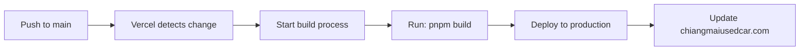

# 🔄 Vercel Auto-Deployment Setup Guide

## chiangmaiusedcar.com - การตั้งค่า Deploy อัตโนมัติ

---

## 📋 ขั้นตอนการตั้งค่า Auto-Deployment

### 1. เข้าสู่ Vercel Dashboard

1. ไปที่ [vercel.com](https://vercel.com)
2. เข้าสู่ระบบด้วยบัญชี GitHub ที่เชื่อมต่อกับ repo `chiangmaiusedcar-next`

### 2. เลือกโปรเจค

1. คลิกที่โปรเจค **`chiangmaiusedcar-next`**
2. ไปที่แท็บ **Settings**

### 3. ตั้งค่า Git Integration

#### A. ไปที่ Settings → Git

```
🔧 Git Configuration:
┌─────────────────────────────────────┐
│ Repository: Nblues/chiangmaiusedcar-next
│ Production Branch: main             │ ← ตั้งค่าตรงนี้
│ Automatically deploy on push: ON   │ ← เปิดตัวนี้
└─────────────────────────────────────┘
```

#### B. ตัวเลือกที่ต้องเปิด:

- ✅ **Automatically deploy on push to main**
- ✅ **Enable automatic deployments from Git**
- ✅ **Deploy previews for pull requests**

### 4. ตั้งค่า Branch Protection (ไม่บังคับ)

```
🛡️ Production Branch Settings:
┌─────────────────────────────────────┐
│ Production Branch: main             │
│ Preview Branches: all branches      │
│ Ignored Build Step: (empty)         │
└─────────────────────────────────────┘
```

---

## ⚙️ การทำงานของระบบ Auto-Deploy

### 🔄 Workflow ที่ตั้งค่าแล้ว:



### 📊 การทำงานอัตโนมัติ:

1. **git push origin main** → เริ่ม deployment ทันที
2. **Pull Request merge** → deploy หลังจาก merge เข้า main
3. **Direct commit to main** → deploy อัตโนมัติ
4. **Manual trigger** → สามารถ deploy ด้วยตนเองได้

---

## 🔔 Notification Settings

### การแจ้งเตือน Deployment:

1. ไปที่ **Settings → Notifications**
2. เปิดการแจ้งเตือนที่ต้องการ:

```
📧 Email Notifications:
✅ Deployment succeeded
✅ Deployment failed
✅ Domain configuration changed

🔗 Webhook Notifications (ไม่บังคับ):
□ Slack integration
□ Discord integration
```

---

## 🚦 Build & Deploy Configuration

### ตั้งค่าใน Vercel Dashboard:

```
⚙️ Build & Development Settings:
┌─────────────────────────────────────┐
│ Framework Preset: Next.js           │
│ Build Command: pnpm build           │
│ Output Directory: .next              │
│ Install Command: pnpm install       │
│ Development Command: pnpm dev       │
└─────────────────────────────────────┘
```

### Environment Variables:

```
🔑 Production Environment Variables:
┌─────────────────────────────────────┐
│ SHOPIFY_DOMAIN                      │
│ SHOPIFY_STOREFRONT_TOKEN            │
│ NEXT_PUBLIC_RECAPTCHA_SITE_KEY      │
│ RECAPTCHA_SECRET_KEY                │
│ NEXT_PUBLIC_EMAILJS_SERVICE_ID      │
│ NEXT_PUBLIC_EMAILJS_TEMPLATE_ID     │
│ NEXT_PUBLIC_EMAILJS_PUBLIC_KEY      │
│ SITE_URL                            │
└─────────────────────────────────────┘
```

---

## 📈 Monitoring & Analytics

### 1. Deployment Status

- Dashboard แสดงสถานะ deployment ล่าสุด
- Log ของการ build และ deploy
- Performance metrics

### 2. Domain Status

```
🌐 Domain Configuration:
┌─────────────────────────────────────┐
│ chiangmaiusedcar.com → Production   │
│ www.chiangmaiusedcar.com → Redirect │
│ SSL Certificate: Auto-renewed      │
└─────────────────────────────────────┘
```

---

## 🧪 Testing Auto-Deployment

### ทดสอบการทำงาน:

1. **สร้าง test commit:**
```bash
echo "// Test auto-deployment $(date)" >> test-deploy.txt
git add test-deploy.txt
git commit -m "test: auto-deployment verification"
git push origin main
```

2. **ตรวจสอบใน Vercel Dashboard:**
   - ไปที่ **Deployments** tab
   - ดูสถานะการ deploy ล่าสุด
   - รอให้เสร็จ (ประมาณ 2-3 นาที)

3. **ตรวจสอบเว็บไซต์:**
   - เปิด https://chiangmaiusedcar.com
   - ตรวจสอบว่าอัปเดตแล้ว

---

## 🔄 Rollback & Recovery

### กรณี Deployment ผิดพลาด:

1. **Instant Rollback:**
   - ไปที่ Vercel Dashboard → Deployments
   - หา deployment ที่ใช้งานได้ก่อนหน้า
   - คลิก **"Promote to Production"**

2. **Git Rollback:**
```bash
# ย้อนกลับใน Git
git revert <commit-hash>
git push origin main
# → จะ trigger auto-deployment อีกครั้ง
```

---

## ✅ Verification Checklist

หลังตั้งค่าเสร็จ ให้ตรวจสอบ:

- [ ] **Production Branch = main**
- [ ] **Automatically deploy on push = ON**
- [ ] **Domain ชี้ไปที่ production deployment**
- [ ] **SSL Certificate active**
- [ ] **Environment variables ครบถ้วน**
- [ ] **Build command ทำงานได้**
- [ ] **Notifications ตั้งค่าแล้ว**

---

## 🆘 Troubleshooting

### ปัญหาที่พบบ่อย:

**1. Build Failed:**
- ตรวจสอบ Environment Variables
- ดู Build Logs ใน Vercel Dashboard
- ทดสอบ `pnpm build` ใน local

**2. Auto-deploy ไม่ทำงาน:**
- ตรวจสอบ Git integration settings
- Verify webhook permissions
- ลองทำ Manual deploy

**3. Domain ไม่อัปเดต:**
- รอ 2-3 นาทีหลัง deployment สำเร็จ
- Clear browser cache
- ตรวจสอบ DNS settings

---

## 📞 Support

หากมีปัญหา:
- **Vercel Support**: [vercel.com/support](https://vercel.com/support)
- **GitHub Integration**: ตรวจสอบ Repository Settings
- **DNS Issues**: ติดต่อ Domain Registrar

---

## 🎉 สรุป

เมื่อตั้งค่าเสร็จแล้ว:

**✅ ทุกครั้งที่ `git push origin main` → Production deployment ใหม่อัตโนมัติ**

**✅ chiangmaiusedcar.com จะชี้ไปที่เวอร์ชันล่าสุดเสมอ**

**✅ ระบบ CI/CD ทำงานแบบ 24/7 ไม่ต้องจัดการเอง**
